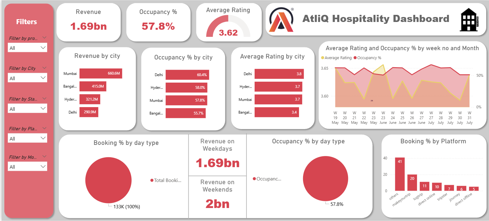
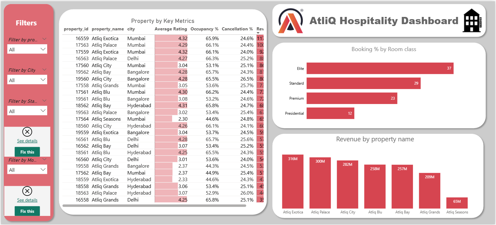
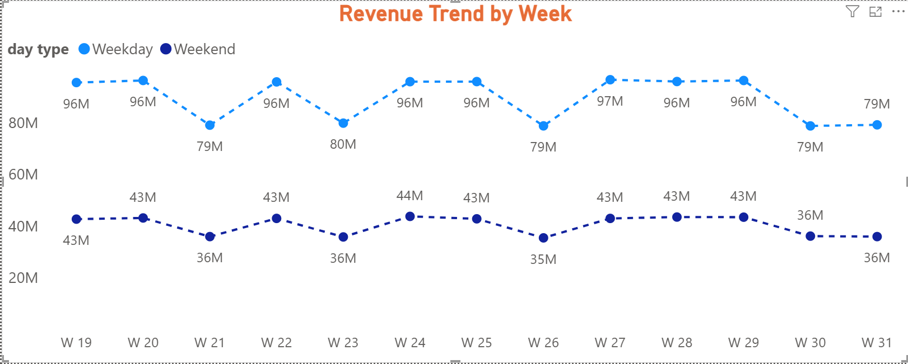
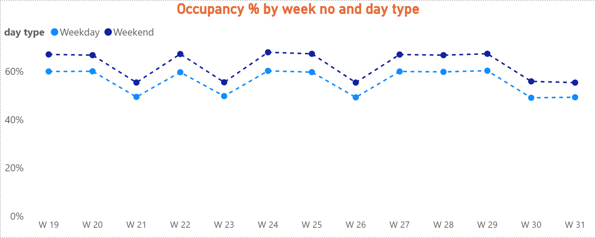
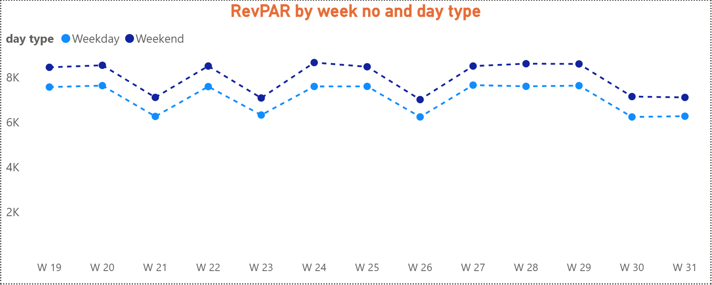
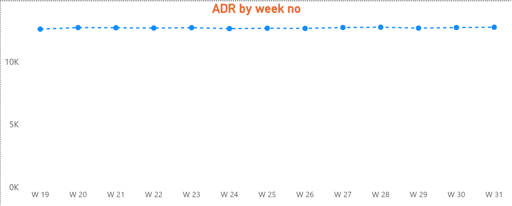
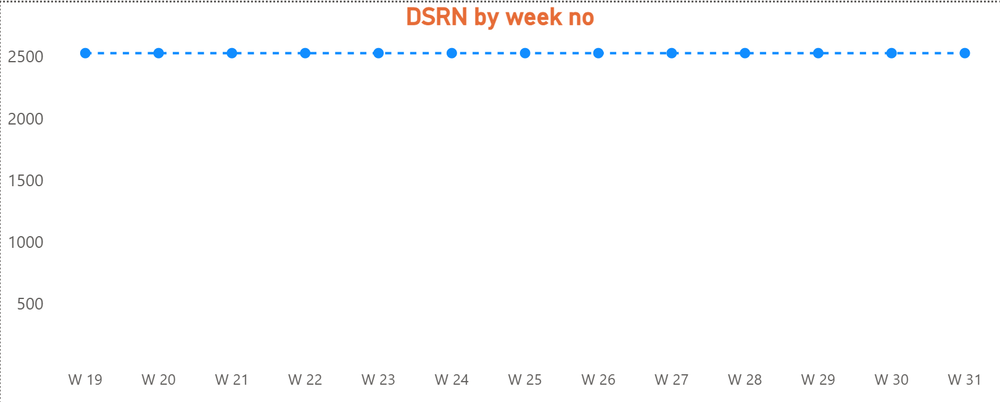
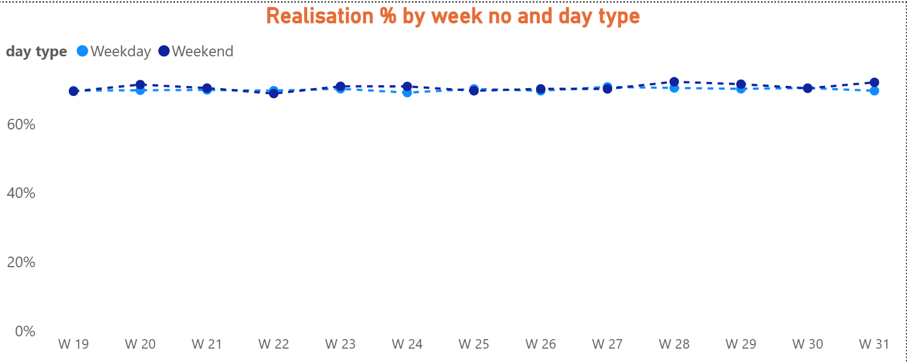
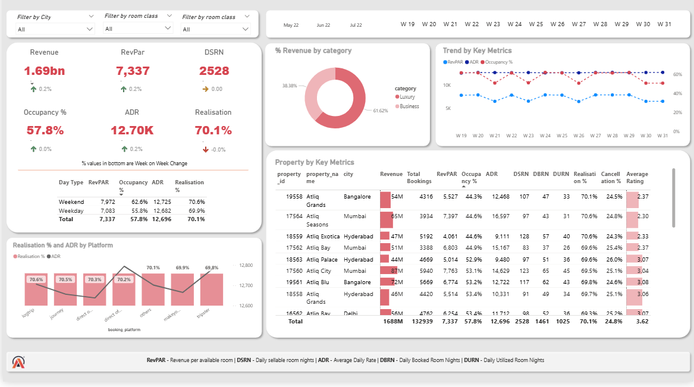

# 🏨 Revenue Insights in Hospitality Domain — AtliQ Grands


---

# 📋 Table of Contents

- 📌 Project Overview
- 🎯 Objective
- 🗂️ Dataset Information
- 🧠 Key Business Metrics
- 🛠️ Tools & Techniques Used
- ⚙️ Data Transformation Steps
- 📊 Dashboard Screenshots
- 💡 Key Insights
- 📈 Dashboard Analysis Approach
- 📁 Repository Structure
- 🚀 How to Use This Project

---

# 📌 Project Overview

AtliQ Grands is a well-established hospitality company that owns multiple five-star hotels across India. With over 20 years in the industry, it operates in both the Luxury and Business hotel categories across major cities — Mumbai, Delhi, Hyderabad, and Bangalore.

Recently, AtliQ Grands has been losing market share and revenue due to strategic moves from competitors and ineffective decision-making. To counter this, the Managing Director decided to adopt Business and Data Intelligence as a strategic initiative.

Since the company lacked an in-house analytics team, a third-party service provider (that's me!) was hired to analyze historical data and deliver actionable revenue insights through an interactive Power BI dashboard.

---

# 🎯 Objective

Build a comprehensive Revenue Intelligence Dashboard that empowers stakeholders to:

- Identify performance gaps.
- Understand booking behaviour.
- Analyze occupancy trends.
- Track revenue performance.
- Support data-driven decision-making.

---

# 🗂️ Dataset Information

The dataset consists of 5 CSV files covering May – July (Weeks 19–31).

| File | Description |
|--------|------------|
| dim_date.csv | Date information |
| dim_hotels.csv | Hotel details and category |
| dim_rooms.csv | Room type information |
| fact_aggregated_bookings.csv | Successful bookings and room capacity |
| fact_bookings.csv | Individual booking records |

### Column Highlights (fact_bookings)

| Column | Description |
|----------|------------|
| booking_id | Unique booking identifier |
| booking_status | Checked Out / Cancelled / No Show |
| booking_platform | Booking platform |
| revenue_generated | Potential revenue |
| revenue_realized | Actual revenue received |
| ratings_given | Customer rating |
| no_guests | Number of guests |

---

# 🧠 Key Business Metrics

| Metric | Formula |
|----------|---------|
| RevPAR | Revenue ÷ Total Rooms Available |
| ADR | Revenue ÷ Rooms Sold |
| Occupancy % | Rooms Occupied ÷ Rooms Available |
| DSRN | Daily Sellable Room Nights |
| Realisation % | URN ÷ BRN |
| URN | Utilized Room Nights |
| BRN | Booked Room Nights |

> ⚠️ Hospitality Industry Definition:
>
> Weekdays = Sunday–Thursday  
> Weekends = Friday–Saturday

---

# 🛠️ Tools & Techniques Used

### Tools

- Power BI Desktop
- Power Query
- DAX
- Excel

### Skills Applied

- Star Schema Data Modelling
- DAX Measures
- Calculated Columns
- KPI Cards
- Conditional Formatting
- Dynamic Titles
- Bookmarks and Navigation
- Week-on-Week Analysis

---

# ⚙️ Data Transformation Steps

### Power Query

- Removed existing day_type column.
- Recreated day_type according to industry standards.
- Fixed headers in dim_rooms.
- Imported all CSV files through Folder Connector.
- Established relationships between tables.

### Key DAX Measures

#### Revenue

```DAX
Revenue =
SUM(fact_bookings[revenue_realized])
```

#### Occupancy %

```DAX
Occupancy % =
DIVIDE([Total Rooms Occupied],[Total Rooms Available])
```

#### ADR

```DAX
ADR =
DIVIDE([Revenue],[Rooms Sold])
```

#### RevPAR

```DAX
RevPAR =
DIVIDE([Revenue],[Total Rooms Available])
```

#### Realisation %

```DAX
Realisation % =
DIVIDE([URN],[BRN])
```

---

# 📊 Dashboard Screenshots

## 🔹 Main Revenue Insights Dashboard



---

## 🔹 Property-Level Key Metrics



---

## 🔹 Revenue Trend by Week



---

## 🔹 Occupancy Percentage



---

## 🔹 RevPAR



---

## 🔹 ADR



---

## 🔹 DSRN



---

## 🔹 Realisation Percentage



---

## 🔹 Detailed Revenue Insights



---

# 💡 Key Insights

- 📍 Mumbai generates the highest revenue.
- 🏆 AtliQ Exotica is the top-performing property.
- 🛏️ AtliQ Bay has the highest occupancy rate (66%).
- 📅 Week 24 recorded peak revenue at ₹139.6M.
- 🌆 Delhi leads in occupancy and ratings.
- ❌ ₹298M revenue loss due to cancellations.
- 🛎️ Elite room class has the highest bookings and cancellations.
- 💰 Luxury hotels contribute ~61.62% of total revenue.
- 📉 Weekends consistently outperform weekdays.
- 📱 MakeYourTrip drives ~41% of bookings.
- 🔄 Realisation % remains around 70%.

---

# 📈 Dashboard Analysis Approach

### Level 1 — Diagnostic Analysis

KPIs:

- Revenue
- RevPAR
- Occupancy %
- ADR
- DSRN
- Realisation %

### Level 2 — Deep Dive Analysis

Breakdown by:

- City
- Property
- Platform
- Room Class

---

# 📁 Repository Structure

```text
📦 Revenue-Insights-Hospitality-Domain
├── 📂 Images
│   ├── Revenue-Insights.png
│   ├── property_key_metrics.png
│   ├── Revenue_trend_by_week.png
│   ├── occupancy_percentage.png
│   ├── Revpar.png
│   ├── ADR.png
│   ├── DSRN.png
│   ├── realisation_percentage.png
│   └── revenue_insights.png
├── Revenue Insights in Hospitality Domain.pbix
└── README.md
```

---

# 🚀 How to Use

### Clone Repository

```bash
git clone https://github.com/wasif32/Revenue-Insights-Hospitality-Domain.git
```

### Open Power BI File

Open:

```
Revenue Insights in Hospitality Domain.pbix
```

using Power BI Desktop.

Update the data source path if required.

Explore using filters:

- Property
- City
- Booking Status
- Platform
- Month

---

# ⭐ Support

If you found this project useful, please give it a ⭐ on GitHub.

**Happy Analyzing! 🚀**
